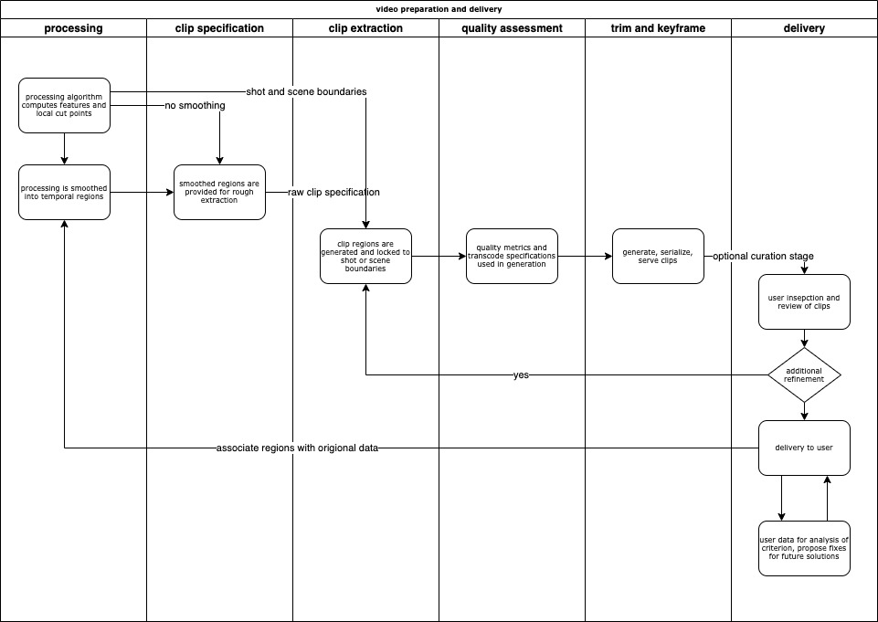

clip-extractor
==============

A method to run clip extraction on new content with hooks for
operation within the `ContentAI Platform <https://www.contentai.io>`__.

**This is a skeleton project that will be updated as it is developed**

1. `Getting Started <#getting-started>`__
2. `Testing <#testing>`__
3. `Changes <#changes>`__

Getting Started
===============

This library can be used as a `single-run
executable <#contentai-standalone>`__. Runtime parameters can be passed
for processing that configure the returned results and can be examined in
more detail in the `main <main.py>`__ script.

- Main Input
    -  ``path_content`` - *(str)* - input video path for files to label (*default=video.mp4*)
    -  ``path_result`` - *(str)* - output path for samples (*default=.*)
    -  ``path_scenes`` - *(str)* - FILE to specify scene begin,end or DIRECTORY with extractor event outputs (*default=``path_content``*)
    -  ``quiet`` - *(flag, no arg)* - verbose input/output configuration printing (*default=false*)
    -  ``csv_file`` - *(str)* - also write output records to this CSV file
- Encoding Specification
    -  ``profile`` - *(string)* - specify a specific transcoding profile for the output video clips
    -  ``overwrite`` - *(flag)* - force overwrite of existing files at result path  (*default=false*)
- General Boundaries
    -  ``finalize_type`` - *(string)* - what tag_type should be used for clip alignment (as a fallback) (*default=None*) (added v1.0.3)
    -  ``duration_min`` - *(float)* - minimum length in seconds for scene selection (*default=10*)
    -  ``duration_max`` - *(float)* - max duration in seconds from scene selction or clip specification (-1 disables) (*default=-1*)
- Scene Specification
    -  ``event_type`` - *(string)* - specify an event type to look for in generation (*default=tag*)
    -  ``event_expand_length`` - *(float)* - expand instant events to a minimum of this length in seconds (*default=5*)
    -  ``event_min_score`` - *(float)* - min confidence for new event to be use in trim (*default=0.6*)
    -  ``clip_bounds`` - *(float, float)* - fixed scene timing (instead of events); start/stop (10 36) or negative stop trims from end (10 -10)
- Alignment Specification
    -  ``alignment_type`` - *(string)* - what tag_type should be used for clip alignment (*default=None*)
    -  ``alignment_extractors`` - *(string list)* - use shots only from these extractors during alignment (*default=None*)
    -  ``alignment_no_shrink`` - *(flag, no arg)* - forbid shrinking alignment during processing (*default=False*)

Clip Extractor Operations
-------------------------

1. Pre-processing - Steps to be determined before any transcoding or clipping is performed.
   
   * Letterbox detection - will use tools to analyze the first N seconds of video and
     determine if the content is letterboxed.  (profile=letterbox)

2. Scene Detection - Determine the start and end times for a scene, defined with fixed or event-type scores.

3. Alignment and Trimming - Trim the raw scenes by events found from upstream analysis.

4. Transcoding and clipping - All-in-one steps to simultaneously seek to and clip out a region
   of video.  Here, different profiles are available and can be specified via the ``profile`` 
   paremeter above.
   
 
Execution and Deployment
========================

This package is meant to be run as a one-off processing tool that
aggregates the insights of other extractors.

Locally Run
-----------

Run the code as if it is an extractor. In this mode, configure a few
environment variables to let the code know where to look for content.

To install package dependencies in a fresh system, the recommended
technique is a combination of conda and pip packages. The latest
requirements should be validated from the ``requirements.txt`` file but
at time of writing, they were the following.

.. code:: shell

   pip install --no-cache-dir -r requirements.txt 

One can also run the command-line with a single argument as input and
optionally ad runtime configuration (see `runtime
variables <#getting-started>`__) as part of the ``EXTRACTOR_METADATA``
variable as JSON.

For utility, the above line has been wrapped in the bash script
``run_local.sh``.

.. code:: shell

    RUNARGS="$3"
    EXTRACTOR_METADATA="$RUNARGS" EXTRACTOR_NAME=dsai_clip_extractor EXTRACTOR_JOB_ID=1 \
        EXTRACTOR_CONTENT_PATH=$1 EXTRACTOR_CONTENT_URL=file://$1 EXTRACTOR_RESULT_PATH=$2 \
        python -u main.py

This allows a simplified command-line specification of a run
configuration, which also allows the passage of metadata into a
configuration.

*Normal result generation into compressed CSVs (with overwrite).*

.. code:: shell

    (*) Certain tag types expand to special multi-tag classes...
        tag:face -> search among tag_type 'tag' but tag name must contain 'face'
        identity:speaker\_ -> search among tag_type 'identity' but tag name must contain 'speaker\_'
        identity:^speaker\_ -> search among tag_type 'identity' but tag name must *NOT* contain 'speaker\_'

    Example execution patterns...
        # detect scenes from transcript output (max of 90s), then apply standard trimming, forbid "shrinking" during alignment
        python main.py --path_content results-witch/video.mp4 \
            --path_result results-witch/test --duration_max 90 --alignment_type transcript --profile popcorn --alignment_no_shrink

        # using an existing video, bootstrap a scene boundary from 15s from the start and 15s from the end
        #   align using tags of type 'tag' containing the word 'face'; write CSV output and uniquely tag each output
        python main.py --path_content results-witch/video.mp4 --profile popcorn --snack_id 12 --csv_file output.csv\
            --path_result results-witch/test --clip_bounds 15 -15 --duration_max 90 --alignment_type "tag:face" 

        # using an existing video, bootstrap a scene boundary from 15s from the start and 15s from the end, apply a
        #   maximum duration of 90s and trim with transcrips, generate video on completion
        python main.py --path_content results-witch/video.mp4 --profile popcorn \
            --path_result results-witch/test --clip_bounds 15 -15 --duration_max 90 --alignment_type transcript 

        # using an existing video, bootstrap a scene boundary from 15s from the start and 15s from the end, apply a
        #   maximum duration of 90s and trim with transcrips
        python main.py --path_content results-witch/video.mp4 --finalize_type tag \
            --path_result results-witch/test --clip_bounds 15 -15 --duration_max 90 --alignment_type transcript 

        # using an existing video, bootstrap a scene bonudary from 5s from the start and 5s from the end, trim with 
        #   detected identity tags and do not encode a resultant video or frame (no profile provided)
        python main.py --path_content results-witch/HBO_20200222_114000_000803_00108_season_of_the_witch.mp4/video.mp4 \
            --path_result results-witch/test --clip_bounds 5 -5 --alignment_type identity

Deploy and Run
~~~~~~~~~~~~~~

.. code:: shell

   contentai deploy <my_extractor>
   Deploying...
   writing workflow.dot
   done

.. code:: shell

   contentai run s3://bucket/video.mp4 -w 'digraph { dsai_clip_extractor }' -d '{"verbose":true, "threshold_value":0.0}'

   JOB ID:     1Tfb1vPPqTQ0lVD1JDPUilB8QNr
   CONTENT:    s3://video-data-extraction-dev/videos/Conan_10seconds.mp4
   STATE:      complete
   START:      Fri Nov 15 04:38:05 PM (6 minutes ago)
   UPDATED:    1 minute ago
   END:        Fri Nov 15 04:43:04 PM (1 minute ago)
   DURATION:   4 minutes 

   EXTRACTORS

   my_extractor

   TASK      STATE      START           DURATION
   724a493   complete   5 minutes ago   1 minute 

Similarly you can run the code locally.

::

   EXTRACTOR_NAME=dsai_clip_extractor \
   EXTRACTOR_CONTENT_PATH=$PWD/CNN-clip.mp4 \
   EXTRACTOR_RESULT_PATH=$PWD/results \
   python main.py

Or run it via the docker image…

::

   docker run --rm  -v `pwd`/:/x -e EXTRACTOR_CONTENT_PATH=/x/file.mp4 -e EXTRACTOR_RESULT_PATH=/x/result2 -e EXTRACTOR_METADATA='{"verbose":true, "threshold_value":0.0}' dsai_clip_extractor

view extractor logs (stdout)
~~~~~~~~~~~~~~~~~~~~~~~~~~~~

.. code:: shell

   contentai logs -f <my_extractor>
   my_extractor Fri Nov 15 04:39:22 PM writing some data
   Job complete in 4m58.265737799s

For an example of how to chain extractors together, see `this
post <extractor-chaining.md>`__.

Testing
=======

(testing and validation forthcoming)

Changes
=======

1.0
---

- 1.1.0
    - switch to pypi packages for the [metadata flattener](https://pypi.org/project/contentai-metadata-flatten/) and [contentai library](https://pypi.org/project/contentaiextractor/)

- 1.0.4
    - fixes for reverse search during alignment, add flag ``--alignment_no_shrink`` to disable

- 1.0.3
    - fallback event type added, more verbosity when that fallback is chosen
    - don't skip/abort trimming if there is no start marker found
    - fix duration requirement bug for detection of events 
    - refactor to allow event trimming
    - add new capabilities to exclude/include different sub-types of a tag
    - add event source information to output files
    

- 1.0.2
    - refactor to allow trimming/alignment events to be recorded
    - output results to JSON (and optional CSV)
    - refactor/reorder some comments to indicate current operation mode
    - add ability to skip clip generation (profile=none)
    - add ability to specify a hard limit for clip generation

- 1.0.1
    - fixes for windows and ffmpeg
    - alignment of scene path with directory expectation
    - update parameters in README
    - default scene path to be content source path
    - convert several script and shell commands to pythonic functions

- 1.0.0
    - initial creation
